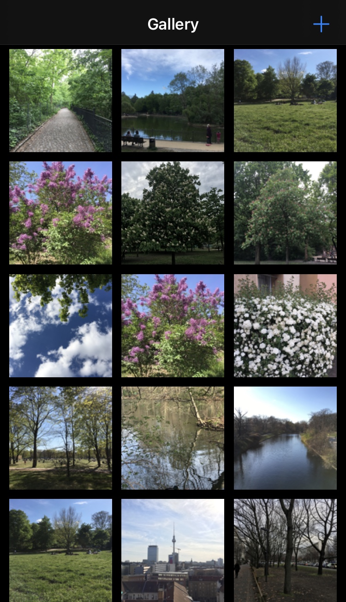
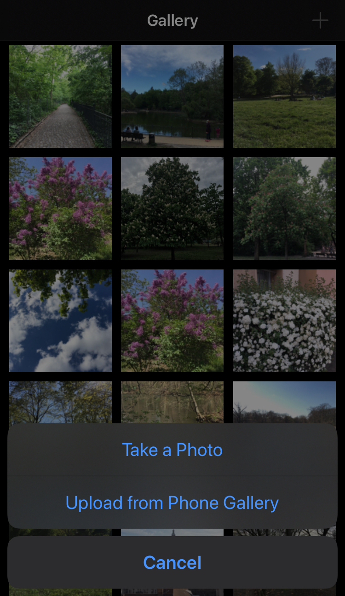

# photo-gallery

A simple photo gallery iOS application.

- Photos are stored locally in your phone.
- To add a photo to the library you should either take a photo, or upload from photo library.

    

   

